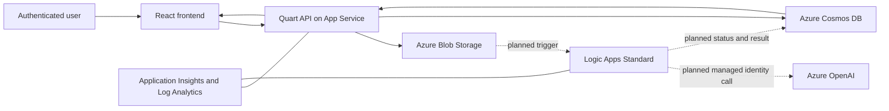

# AI Solution Starter

AI Solution Starter is a reusable Azure application baseline with a React web
frontend, Quart API, Blob Storage, Cosmos DB, Logic Apps Standard, Azure
OpenAI, managed identity, monitoring, private networking, and automated
deployment. The included PDF work-item experience is intentionally small and
replaceable.

> [!IMPORTANT]
> The Bicep baseline is immutable. Do not optimize, reorganize, or simplify
> files under `infra/`. Adapt application code around the established
> infrastructure contract.

## Component status

| Component | Status |
| --- | --- |
| Azure infrastructure and deployment baseline | Implemented and checksum protected |
| Quart backend and persistence contracts | Implemented locally; pending review/push |
| React frontend and static hosting | Implemented locally; pending review/push |
| Logic App and Azure OpenAI processing workflow | Planned in Phase 4; not implemented |
| Starter-readiness documentation and validation | Implemented locally; pending review |

The repository does not yet claim a completed deployed AI vertical slice. See
the [phased plan](docs/PLAN.md) and
[Phase 4 plan](docs/phases/PHASE_4_IMPLEMENTATION_PLAN.md).

## Architecture



The application currently accepts authenticated PDF uploads up to 20 MB,
stores them under a server-generated Blob path, persists owner-scoped work-item
records, and displays every lifecycle state. Phase 4 will supply the real
`queued -> processing -> completed/failed` AI workflow.

## Repository layout

```text
app/frontend/       React 19, TypeScript, Vite, and Material UI
app/backend/        Quart API and production container
app/agent/          Logic App package boundary
infra/              Immutable Azure Bicep baseline
scripts/            Setup, deployment, validation, and sample helpers
docs/               Architecture, development, deployment, and replacement docs
tests/              Cross-component fixtures and generated sample boundary
.github/            CI, deployment workflows, and composite actions
```

## Prerequisites

Local validation uses:

- Git
- Python 3.12
- Node.js 20.19 or later in the Node 20 line
- npm
- Docker
- Azure CLI with Bicep support

Azure deployment additionally requires Azure Developer CLI, an Azure
subscription, and the permissions described in
[Prerequisites](docs/development/PREREQUISITES.md).

## Clone and set up

```bash
git clone https://github.com/lucusc/ai-solution-starter.git
cd ai-solution-starter

python3 -m venv .venv
.venv/bin/python -m pip install -r app/backend/requirements-dev.txt

cd app/frontend
npm ci
cd ../..
```

Generate the synthetic hello-world PDF:

```bash
.venv/bin/python scripts/generate_sample_pdf.py \
  tests/sample-data/generated/hello-world.pdf
```

Generated PDFs and frontend assets are ignored and must not be committed.

## Validate

Run one validation area:

```bash
./scripts/validate.sh application
./scripts/validate.sh infrastructure
./scripts/validate.sh repository
```

Run every implemented-component check:

```bash
./scripts/validate.sh all
```

Local validation does not provision or modify Azure resources. See the
[validation reference](docs/development/VALIDATION.md) for individual
commands and expected prerequisites.

## Develop and deploy

- [Local setup and development](docs/development/LOCAL_SETUP.md)
- [Architecture overview](docs/architecture/OVERVIEW.md)
- [Application flow](docs/architecture/APPLICATION_FLOW.md)
- [Deployment sequence](docs/deployment/DEPLOYMENT_SEQUENCE.md)
- [Deployment configuration](docs/deployment/CONFIGURATION.md)
- [Troubleshooting](docs/deployment/TROUBLESHOOTING.md)
- [Azure cost drivers](docs/operations/COST_DRIVERS.md)

Azure-mutating commands require a separately approved environment and are
clearly marked in the deployment documentation.

## Replace the hello-world application

Start with the [replacement guide](docs/replacement/REPLACEMENT_GUIDE.md).
The normal direction is:

- preserve infrastructure, identity, networking, telemetry, and deployment
  mechanisms;
- replace work-item domain models, prompts, result schema, pages, and fixtures;
- update backend, workflow, and frontend contracts together; and
- add optional Azure services through reviewed conditional modules under
  `infra/modules/ai/`.

## Repository policy

Never commit real documents, credentials, tenant or subscription values,
customer identifiers, private repository references, generated PDFs, or
copied proprietary material. Follow the
[source sanitization policy](docs/SOURCE_SANITIZATION.md).

Contributions are governed by:

- [Contributing](CONTRIBUTING.md)
- [Security](SECURITY.md)
- [Support](SUPPORT.md)
- [Code of Conduct](CODE_OF_CONDUCT.md)

## License

This project is licensed under the [MIT License](LICENSE).
