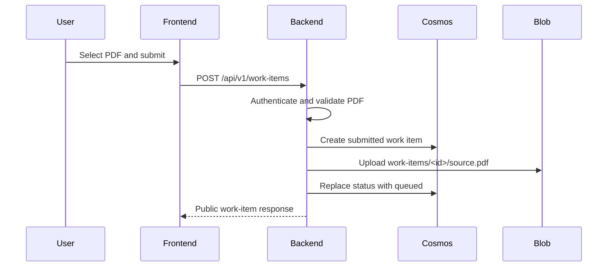

# Application flow

## Implemented intake flow



The API accepts PDFs only, up to 20 MB. A required idempotency key prevents an
ambiguous client retry from creating another work item.

## Planned processing flow

Phase 4 will implement:

```text
queued
  -> Logic App claims processing with Cosmos ETag
  -> reads PDF and generic instructions
  -> calls Azure OpenAI with managed identity
  -> validates summary, category, and key_points
  -> persists completed or failed
```

This segment is not implemented yet. See the
[Phase 4 plan](../phases/PHASE_4_IMPLEMENTATION_PLAN.md).

## Read flow

The frontend lists owner-scoped records and loads one detail route. It polls
only an open nonterminal detail view. Polling stops on `completed`, `failed`,
authorization failure, not-found, navigation, or page cleanup.

## Lifecycle ownership

| Transition | Owner |
| --- | --- |
| create `submitted` | Backend |
| `submitted -> queued` | Backend |
| `submitted -> failed` | Backend intake compensation |
| `queued -> processing` | Planned Logic App |
| `processing -> completed` | Planned Logic App |
| `processing -> failed` | Planned Logic App |

Completed and failed records are terminal.
