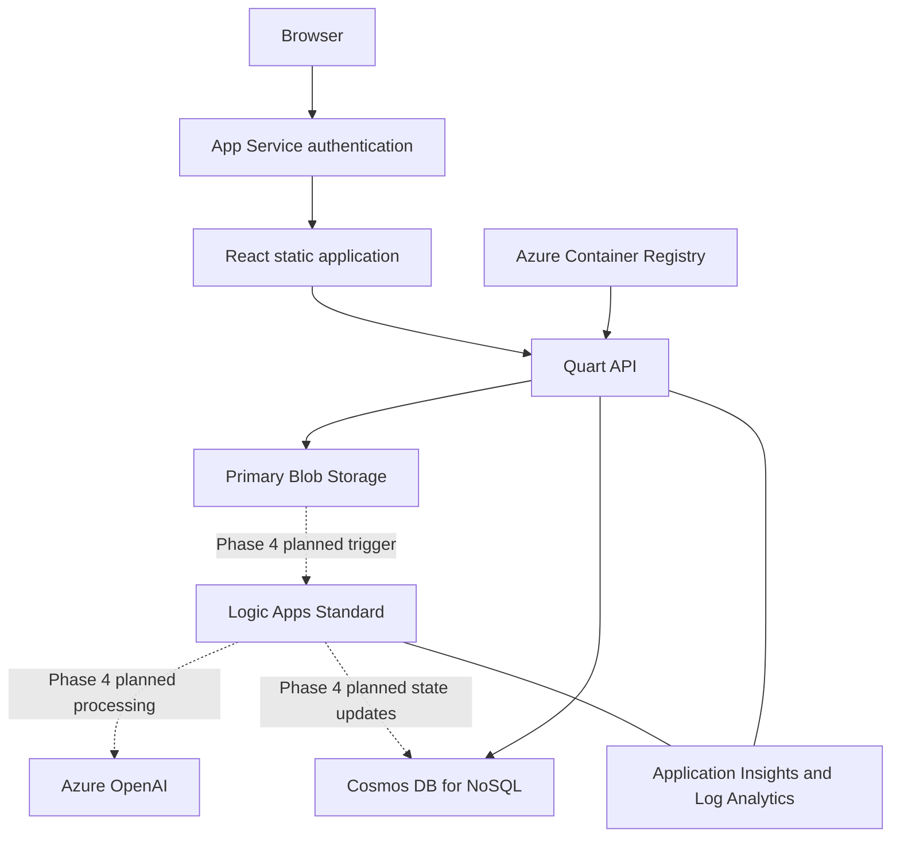

# Architecture overview

## Runtime topology

The backend container serves both the API and the compiled frontend. Browser
requests remain same-origin in production.

## Security boundaries

- App Service authentication establishes the production user identity.
- Backend authorization scopes every work-item read to the authenticated owner.
- Managed identities access Storage, Cosmos DB, Azure OpenAI, monitoring, and
  container images.
- Shared-key and public Blob access are disabled by the infrastructure
  baseline.
- The baseline supports private endpoints, VNet integration, and private DNS.
- Application responses do not expose owner IDs, Blob paths, Cosmos partition
  values, idempotency hashes, or ETags.

See the [RBAC matrix](../infrastructure/RBAC_MATRIX.md) and
[networking matrix](../infrastructure/NETWORKING_MATRIX.md).

## Component boundaries

| Boundary | Responsibility |
| --- | --- |
| `infra/` | Immutable Azure resource topology and configuration |
| `app/backend/` | Authentication, validation, persistence, API, and static hosting |
| `app/frontend/` | Replaceable browser experience over the public API |
| `app/agent/` | Logic App workflow package boundary |
| `scripts/` | Local setup, validation, and controlled deployment helpers |
| `.github/` | CI and operator-approved Azure deployment |

The Logic App business workflow is planned but not implemented. Its approved
contract is in the
[Phase 4 implementation plan](../phases/PHASE_4_IMPLEMENTATION_PLAN.md).

## Deployment boundaries

Azure Developer CLI provisions the baseline. Application deployment builds the
frontend into the backend image and deploys the Logic App package when one is
implemented. Deployment is separate from local validation and always requires
an explicitly selected Azure environment.
